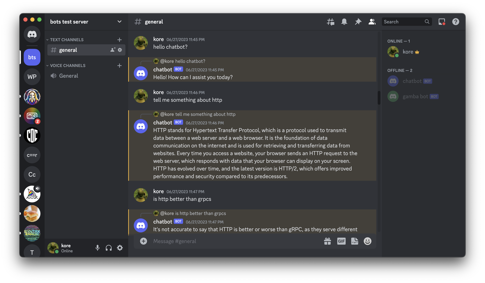

<h1>Discord Chat Assistant</h1>
<p >
  Discord Bot that uses OpenAI's GPT-3 to generate responses to messages in your Discord server.
</p>

<p >
  <a href="#description"><strong>Description</strong></a> ·
  <a href="#features"><strong>Features</strong></a> ·
  <a href="#running-locally"><strong>Running locally</strong></a> ·
</p>
<br/>

## Description

This project is a personalized `Discord Bot` that uses OpenAI's GPT-3 to generate responses to messages in your Discord server. The project is implemented in a [Javascript](https://developer.mozilla.org/en-US/docs/Web/JavaScript) environment.



## Features

- [OpenAI API](https://beta.openai.com/docs/api-reference) for generating responses.
- [DiscordJS](https://discord.js.org/#/) for Discord API.
- [Dotenv](https://www.npmjs.com/package/dotenv) for environment variables.


## Running locally

You will need to have the necessary environment variables setup in your `.env` file.
This include your discord bot token, and openai api key. 
    
```bash
TOKEN =
OPENAI_API_KEY =
```

> Note: You should not commit your `.env` file or it your bot is compromised and your openai api key is public 🤓

## Running locally with docker

```bash
docker login
docker pull korebhaumik/gpt-discord-bot:latest 
docker run -env-file .env -p 3000:3000 korebhaumik/gpt-discord-bot
```

> Note: If the docker image is not available (repo is privated), you can build it locally by running `docker build -t gpt-discord-bot .` in the root directory of the project.